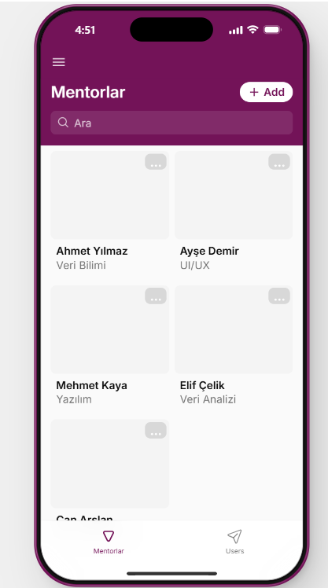
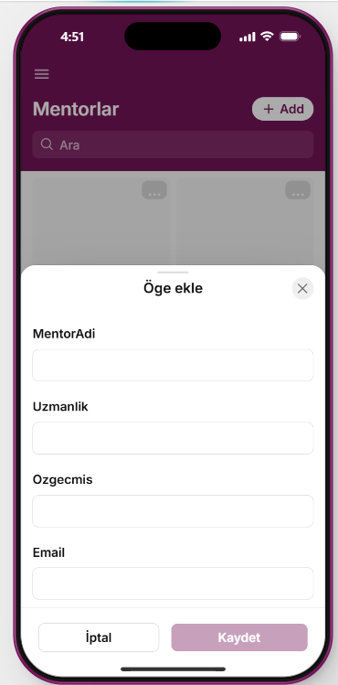
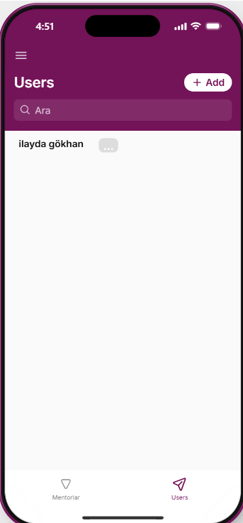

# Sanal Mentor Uygulaması

Sanal Mentor, kullanıcıların farklı uzmanlık alanlarındaki mentorları listeleyebilmesi, arayabilmesi ve profil bilgilerini görüntüleyebilmesi amacıyla Glide üzerinde geliştirilmiş no-code mobil uygulama prototipidir.

## Projenin amacı

Bu çalışma, kod yazmadan veri kaynağı, kullanıcı arayüzü ve kullanıcı etkileşimi arasındaki ilişkiyi deneyimlemek amacıyla hazırlanmıştır. Mentor bilgileri veri tablosunda tutulmakta ve Glide arayüzünde dinamik olarak gösterilmektedir.

## Özellikler

- Mentorları kart görünümünde listeleme
- Mentor adına ve uzmanlık alanına göre arama
- Mentor adı, uzmanlık, özgeçmiş ve e-posta bilgilerini yönetme
- Yeni mentor kaydı ekleme
- Mevcut kayıtları düzenleme
- Kullanıcı profili ekranı
- Mobil uyumlu arayüz

## Kullanılan teknolojiler

- Glide
- No-code uygulama geliştirme
- Tablo tabanlı veri yönetimi
- Mobil arayüz tasarımı

## Ekran görüntüleri

### Mentor listesi

### Mentor ekleme

### Kullanıcı ekranı

## Proje raporu

Çalışmanın amacı, kullanılan teknolojiler, uygulamanın çalışma mantığı ve değerlendirmesi `sanal-mentor-proje-raporu.pdf` dosyasında yer almaktadır.

## Canlı demo

Glide ücretsiz planındaki yayın kısıtlaması nedeniyle uygulamanın herkese açık canlı bağlantısı bulunmamaktadır. Uygulama ekranları ve proje raporu bu repoda belgelenmiştir.

## Gizlilik notu

GitHub deposunda kişisel e-posta adresi gösteren ekran görüntülerine yer verilmemiştir.
